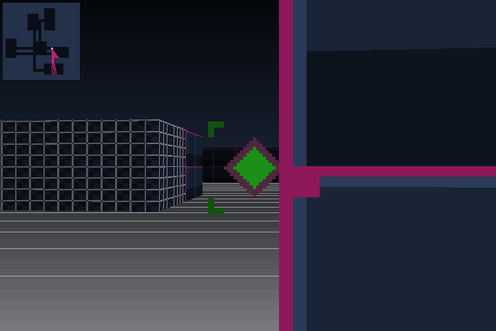

# VioletHat FPS para Game Boy Advance

Motor de raycasting con DDA, escrito desde cero en C++, sin librerías de
raycasting. No eres alguien perdido en un laberinto: eres un programa
infiltrándose en un archivo muerto, y los guardianes que quedan dentro llevan
demasiado tiempo solos.


|                                  |                             |
| -------------------------------- | --------------------------- |
|  |  |

## Estado

Corre en Linux. El port a Game Boy Advance es el siguiente paso: el motor ya
está preparado para él, no queda aritmética de coma flotante en el camino de
render y el framebuffer usa el mismo formato indexado de 8 bits que el modo 4
de la consola.

MVP (sección 29 del documento de diseño):

- [x] DDA
- [x] Renderizado de paredes con textura
- [x] Movimiento y colisiones
- [x] Generación procedural
- [x] Seed reproducible
- [x] Jugador con integridad (HP)
- [x] Un enemigo — el WARDEN
- [x] Un arma — PACKET GUN
- [x] Disparo hitscan
- [x] Los guardianes reciben daño
- [x] El jugador recibe daño
- [x] Salida y cambio de piso
- [x] Fin de run y run nueva
- [x] HUD, pantallas de bienvenida y reglas, marcador final
- [ ] Port a Game Boy Advance

## Compilar y jugar

Hace falta CMake y SDL2.

```sh
cmake -S . -B build
cmake --build build -j
./build/violethat
```

La misma seed reconstruye la misma run entera —mapa, salida y guardianes—, lo
que sirve para reproducir un fallo o repetir una partida concreta:

```sh
./build/violethat 583291
```

Sin argumento, cada partida usa una seed nueva y la imprime al arrancar.

## Controles

| Tecla   | Acción                            | GBA   |
| ------- | --------------------------------- | ----- |
| ↑ ↓     | Avanzar / retroceder              | D-PAD |
| ← →     | Girar                             | D-PAD |
| Espacio | Disparar                          | A     |
| Enter   | Nueva run (al terminar la actual) | START |
| Esc     | Salir                             | —     |

## Puntuación

100 puntos por baja y 250 por cada archivo superado, más 1000 de prima por salir
entero. Se calcula a partir del estado en lugar de acumularse, así no puede
desincronizarse con lo que muestra el HUD.

## Cómo funciona

Cinco pisos. Cada uno se genera con habitaciones y pasillos a partir de la
seed, coloca una salida y reparte guardianes lejos del punto de entrada. Pisar
la salida enlaza con el siguiente archivo y recupera parte de la integridad.
Llegar al final de los cinco cierra la run; quedarse sin integridad también,
pero peor.

Los guardianes duermen hasta que te ven —alcance _y_ línea de visión, no solo
cercanía—, entonces persiguen y golpean con una cadencia fija. Con el jugador a
la vista van derechos; sin verlo siguen un campo de flujo calculado con una
búsqueda en anchura desde la celda del jugador, compartido por todos y rehecho
cuatro veces por segundo. Sin él se quedaban empujando la esquina que tuvieran
delante, para siempre.

El disparo es hitscan: lanza un rayo desde la cámara y, si hay pared antes que
el guardián, se pierde contra la pared.

## Arquitectura

La separación entre motor y plataforma es la restricción que manda, porque es
lo que hace posible el port (sección 7 del documento de diseño).

```
src/engine/    matemática, mapa, DDA, jugador, renderizador. Sin SDL.
src/game/      generación de niveles, guardianes, reglas de la run. Sin SDL.
src/desktop/   la única capa que conoce SDL2. En GBA se sustituye entera.
src/tests/
```

La biblioteca del motor no enlaza contra SDL. Si alguna vez lo necesitara, la
separación estaría rota y el port dejaría de ser posible.

Todo el camino de render usa punto fijo 16.16 con tabla de senos. El
ARM7TDMI de la Game Boy Advance no tiene unidad de coma flotante, así que cada
`float` pasaría por una biblioteca de software. Los `float` que quedan solo se
ejecutan una vez al arrancar, construyendo la paleta y la tabla.

El sombreado por distancia está horneado en la paleta: cada color base aparece
ya multiplicado por ocho niveles de luz, de modo que el bucle interno suma un
entero en lugar de escalar componentes de color.

La estética está fijada en [DESIGN.md](DESIGN.md). El verde es exclusivo de los
enemigos: es la única señal de peligro del juego y pierde su valor en cuanto
aparece en una pared. Por eso la barra de integridad es rosa y no verde.

El logotipo es arte ASCII de verdad, no un mapa de bits que lo imite: el juego
va de estar dentro de una máquina, y un sombrero dibujado con guiones bajos y
barras dice eso sin explicarlo. Se dibuja con separación cero entre caracteres,
o los trazos salen punteados.

El texto usa una fuente de mapa de bits 5x7 generada desde arte ASCII. Las
pantallas se maquetan midiendo el bloque y centrándolo, no dejándolo fluir hacia
abajo, para que quepan igual en una ventana grande que en los 240x160 de la
consola.

## Pruebas

```sh
ctest --test-dir build --output-on-failure
```

Cuatro suites. Las que valen algo son estas dos:

- **`game`** conduce al jugador por los cinco pisos con la misma `Input` que
  produce la capa de plataforma, siguiendo una ruta calculada con BFS y
  disparando a lo que se cruza. Comprueba que la run se puede _terminar_, no
  solo perder despacio.
- **`raycaster`** verifica que no hay ojo de pez: mirando de frente a una pared
  plana, todas las columnas deben devolver la misma distancia perpendicular. Es
  el único chequeo que detecta una corrección de coseno que falte o que sobre.
