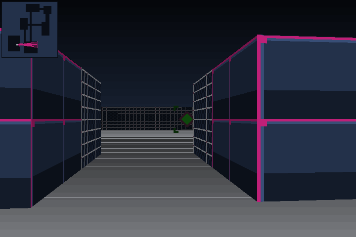
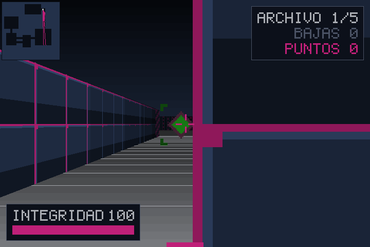
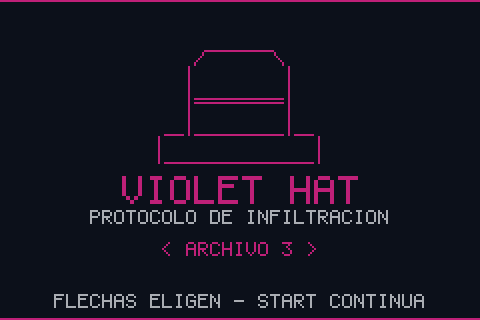
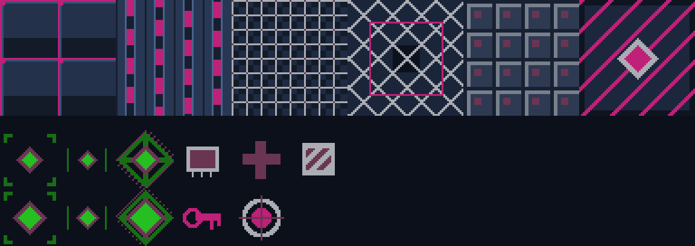

# VioletHat FPS para Game Boy Advance

Motor de raycasting con DDA, escrito desde cero en C++, sin librerías de
raycasting. No eres alguien perdido en un laberinto: eres un programa
infiltrándose en un archivo muerto, y los guardianes que quedan dentro llevan
demasiado tiempo solos.



|                                  |                          |
| -------------------------------- | ------------------------ |
|  |  |

Los seis materiales de pared y todos los sprites, tal como los construye
`src/engine/Textures.h` — no hay archivos de imagen, se dibujan con código:



## Estado

Corre en Linux y **arranca en Game Boy Advance**: `make -f Makefile.gba` deja un
cartucho de 73 KB que se carga en un emulador o en una flashcard. No queda
aritmética de coma flotante en el camino de render y el framebuffer usa el mismo
formato indexado de 8 bits que el modo 4 de la consola.

Lo que le falta a esa ROM está medido, no supuesto. Un frame jugando arrancó
costando 6.460.017 ciclos contra los 559.333 que caben en 1/30 de segundo, o
sea 2,6 fps. Va por 2.527.707 —**6,6 fps**— después de tres cambios, cada uno
medido antes y después:

| Cambio | Frame jugando | |
| --- | ---: | --- |
| Punto de partida | 6.460.017 | 2,6 fps |
| Volcado a VRAM con DMA3 en vez de la CPU | 5.617.317 | 3,0 fps |
| Texels de pared por puntero en vez de `setPixel` | 4.212.843 | 4,0 fps |
| `WAITCNT` = 0x4317 (esperas del cartucho + prefetch) | 2.527.707 | 6,6 fps |
| DDA, texturas y fuente a IWRAM compilados en ARM | 1.965.916 | 8,5 fps |
| Minimapa reescalado, celdas y rayos sin llamadas ni divisiones | 1.685.017 | 10,0 fps |
| `Framebuffer` a IWRAM | 1.404.127 | 12,0 fps |
| Texto por puntero en vez de un `fillRect` por pixel | 1.404.125 | 12,0 fps |
| Un rayo cada dos columnas en la consola | **1.123.221** | **14,9 fps** |

La pantalla de título va a **29,9 fps**, que es el objetivo del port.

El hallazgo que ordenó todo lo demás: el coste dominante no era el pixel, era
**buscar en la ROM el código que lo escribía**. Por eso quitar una llamada del
bucle de texels valió 2,5×, y por eso una sola línea configurando las esperas
del bus del cartucho valió 1,67× sobre el frame entero.

El hallazgo que ordenó todo lo demás: el coste dominante no era el pixel, era
buscar en la ROM el código que lo escribía. IWRAM es el último escalón de eso
mismo —bus de 32 bits, sin esperas— y ahí sí compensa ARM en vez de Thumb.

Mover `Renderer.o` a IWRAM destapó un fallo latente: `Game` mide unos 22 KB
(`Nav` son 16.384 bytes de campos de navegación y cola, `Maze` otros 4.096) y
era una variable local de `main`. La pila de la consola son 32 KB de IWRAM, los
mismos que ahora comparte con el código, así que el puntero de pila bajaba por
debajo del código y lo machacaba. Como `static` vive en `.bss`, que este linker
script manda a EWRAM.

`present()` espera al vblank, así que **cada frame cuesta un múltiplo entero de
los 280.896 ciclos de un barrido de pantalla**. Los ahorros no se ven en los fps
hasta que cruzan uno de esos escalones: el frame jugando ha bajado de nueve
barridos a cinco, y el de título de tres a dos.

Tres veces el sospechoso obvio resultó no serlo, y medir antes de tocar fue lo
que lo evitó. En el minimapa la factura no estaba en el abanico de 24 rayos
sino en las celdas de muro, con una llamada a `fillRect` por celda. Y mover
`Hud.o` a IWRAM valió un 0,9%: lo caro no era su código sino el `Framebuffer`
que llamaba, que seguía en ROM. Y el HUD no necesitó irse a una capa de
hardware —imposible en modo 4, que no tiene capas de tiles— porque `drawText`
pedía un `fillRect` entero por cada pixel encendido de cada glifo.

Y dos cambios que empeoraron el frame antes de mejorarlo, los dos en el bucle
de texels: un `for` interno de longitud variable lo llevó de 267.756 a 682.040
ciclos, y un `std::memcpy` de dos bytes —que debería compilar a un `strh`— a
557.592. La versión buena escribe los dos píxeles como un halfword con un
`typedef may_alias`.

Y el sonido sigue sin engancharse: la consola arranca muda.

MVP (sección 29 del documento de diseño):

- [x] DDA
- [x] Renderizado de paredes con textura
- [x] Movimiento y colisiones
- [x] Generación procedural
- [x] Seed reproducible
- [x] Jugador con integridad (HP)
- [x] Un enemigo — el WARDEN
- [x] Un arma — PACKET GUN
- [x] Disparo hitscan
- [x] Los guardianes reciben daño
- [x] El jugador recibe daño
- [x] Salida y cambio de piso
- [x] Fin de run y run nueva
- [x] HUD, pantallas de bienvenida y reglas, marcador final
- [x] Objetos de sistema — RAM, PATCH, CACHE
- [x] Cámara sellada con llave de archivo
- [x] Jefe final — NUCLEO CENTINELA
- [x] Música y efectos de sonido
- [x] Ratón, mando y selección de archivo
- [x] Port a Game Boy Advance — la ROM arranca y se juega, a 2,6 fps y sin sonido

## Compilar y jugar

Hace falta CMake y SDL2.

```sh
cmake -S . -B build
cmake --build build -j
./build/violethat
```

La misma seed reconstruye la misma run entera —mapa, salida y guardianes—, lo
que sirve para reproducir un fallo o repetir una partida concreta:

```sh
./build/violethat 583291
```

Sin argumento, cada partida usa una seed nueva y la imprime al arrancar.

## Compilar el cartucho de Game Boy Advance

Hace falta [devkitARM](https://devkitpro.org/wiki/Getting_Started) con `libgba`.
El build de consola no usa CMake: tiene su propio makefile porque el compilador,
el linker script y las banderas son otros.

```sh
make -f Makefile.gba
```

Deja `violethat.gba` en la raíz, listo para un emulador o para una flashcard.
Para jugarlo en el PC:

```sh
mgba-qt violethat.gba      # o cualquier emulador: VBA-M, no$gba, mGBA
```

En hardware real hace falta una flashcard (EverDrive GBA, EZ-Flash): se copia
el `.gba` a la tarjeta SD y se arranca desde el menú. La ROM son 73 KB y no usa
memoria de guardado, así que no hay `.sav` que preparar.

Los controles de consola son el D-PAD para andar y girar, **A** para disparar y
**START** para continuar y para empezar una run nueva.

`make -f Makefile.gba profile` compila una segunda ROM, distinta: pulsa START
sola al arrancar y pinta en pantalla el coste en ciclos del frame de título y
del frame jugando, además de volcarlo al log de depuración de mGBA
(`mgba -l 255`). Sirve para medir, no para jugar; el cartucho normal no lleva
nada de eso.

## Controles

| Teclado          | Ratón / mando                        | Acción                     | GBA   |
| ---------------- | ------------------------------------ | -------------------------- | ----- |
| ↑ ↓ / W S        | Stick izquierdo ↕                    | Avanzar / retroceder       | D-PAD |
| ← → / A D        | **Ratón** · stick izquierdo ↔        | Girar                      | D-PAD |
| Espacio · Ctrl   | Clic izquierdo · botón X             | Disparar                   | A     |
| ← → en el título | D-PAD · stick                        | Elegir archivo de entrada  | D-PAD |
| Enter            | START                                | Continuar / nueva run      | START |
| Esc              | —                                    | Salir                      | —     |

El ratón gira con el cursor capturado, así que se puede girar sin tope. El
mando se detecta al arrancar **y al enchufarlo con el juego abierto**. Los
sticks entregan una cantidad, no un sí/no, así que la entrada abstracta lleva
dos campos analógicos (`turn` y `thrust`) que en GBA se quedan en cero y no
cuestan nada.

Hay una diferencia real entre los dos: el ratón entrega un desplazamiento ya
hecho y el stick una velocidad. Por eso el giro del ratón **no** se escala por
el tiempo del frame —hacerlo ataría la sensibilidad a los FPS— y el del stick
sí.

**Todo el movimiento vive en el stick izquierdo**, igual que en el D-PAD de la
consola: el eje horizontal gira la cámara y el vertical camina. El avance sale
siempre en la dirección de la cámara, así que girar cambia hacia dónde se anda.
El stick derecho no se lee, y solo el botón X dispara.

## Selección de archivo

La pantalla de título deja elegir por cuál de los cinco archivos entrar, con
las flechas. Las puntas del selector solo se dibujan del lado al que todavía se
puede mover. El marcador cuenta los archivos desde donde arrancó la run, no
desde el uno, así que entrar por el quinto no regala cuatro pisos de puntos.

## La cámara sellada

Casi todos los pisos esconden una cámara que no tiene pasillo abierto: su único
acceso está cifrado y desde fuera se ve como una puerta con bandas de aviso.
La llave del archivo está en otra sala del mismo piso, y no se arrastra al
siguiente. Al acercarse con ella el cifrado cae y dentro esperan tres piezas de
sistema juntas.

El generador coloca la cámara sobre roca virgen y la sella cerrando **todas** las
celdas de su anillo que quedaron abiertas, no solo la primera. Sellar una sola
dejaba la cámara accesible por el hueco de al lado cuando el pasillo corría
pegado al anillo. La prueba `level` lo comprueba en treinta mapas: con la puerta
cerrada la cámara es la única parte inalcanzable del piso, y al abrirla el piso
vuelve a ser conexo entero. Eso es lo que impide que la puerta caiga sobre el
camino principal y parta el mapa en dos.

## El núcleo centinela

El último archivo tiene un jefe plantado delante del protocolo de extracción,
con seis veces la vida de un guardián y una barra propia arriba de la pantalla.
Mientras siga en pie el protocolo no responde, así que la run no se puede
terminar esquivándolo. Va a un cuarto de la velocidad del jugador y pega a 1.8
celdas: retroceder disparando es la forma prevista de ganarle, y así es como lo
hace el piloto automático de las pruebas.

## Sonido

Siete pistas WAV en `public/audio`: tema principal para las pantallas, tema de
asalto durante la partida, y efectos de disparo, daño, recogida, cambio de
archivo y victoria. El mezclador está escrito sobre el SDL2 que ya usa la
ventana, sin SDL2\_mixer: los siete archivos son mono de 16 kHz y 16 bits,
exactamente el formato con el que se abre el dispositivo, así que no hay ninguna
conversión que hacer y una dependencia más no compraría nada.

La capa de juego no sabe que existe el sonido. El bucle de escritorio detecta
los flancos de lo que `Game` ya expone —fogonazo, interferencia de daño, aviso
de recogida y estado— y dispara los efectos desde ahí. Por eso `game` y `engine`
siguen compilando tal cual para GBA, donde el sonido sale por los canales de DMA
del hardware.

## Puntuación

100 puntos por baja y 250 por cada archivo superado, más 750 por abatir al
núcleo centinela y 1000 de prima por salir entero. Se calcula a partir del estado en lugar de acumularse, así no puede
desincronizarse con lo que muestra el HUD.

## Cómo funciona

Cinco pisos. Cada uno se genera con habitaciones y pasillos a partir de la
seed, coloca una salida y reparte guardianes lejos del punto de entrada. Pisar
la salida enlaza con el siguiente archivo y recupera parte de la integridad.
Llegar al final de los cinco cierra la run; quedarse sin integridad también,
pero peor.

Cada sala repartida por el piso esconde una pieza de sistema: RAM sube la
integridad máxima, PATCH cura y CACHE sube el daño del arma. Los guardianes
pegan fuerte —diez de daño en el primer archivo y veintiséis en el quinto—, así
que recoger es lo que separa llegar al final de morir en el tercero.

Los guardianes duermen hasta que te ven —alcance _y_ línea de visión, no solo
cercanía—, entonces persiguen y golpean con una cadencia fija. Con el jugador a
la vista van derechos; sin verlo siguen un campo de flujo calculado con una
búsqueda en anchura desde la celda del jugador, compartido por todos y rehecho
cuatro veces por segundo. Sin él se quedaban empujando la esquina que tuvieran
delante, para siempre.

El disparo es hitscan: lanza un rayo desde la cámara y, si hay pared antes que
el guardián, se pierde contra la pared.

## Arquitectura

La separación entre motor y plataforma es la restricción que manda, porque es
lo que hace posible el port (sección 7 del documento de diseño).

```
src/engine/    matemática, mapa, DDA, jugador, renderizador. Sin SDL.
src/game/      generación de niveles, guardianes, reglas de la run. Sin SDL.
src/desktop/   la única capa que conoce SDL2. En GBA se sustituye entera.
src/tests/
```

La biblioteca del motor no enlaza contra SDL. Si alguna vez lo necesitara, la
separación estaría rota y el port dejaría de ser posible.

Todo el camino de render usa punto fijo 16.16 con tabla de senos. El
ARM7TDMI de la Game Boy Advance no tiene unidad de coma flotante, así que cada
`float` pasaría por una biblioteca de software. Los `float` que quedan solo se
ejecutan una vez al arrancar, construyendo la paleta y la tabla.

El sombreado por distancia está horneado en la paleta: cada color base aparece
ya multiplicado por seis niveles de luz, de modo que el bucle interno suma un
entero en lugar de escalar componentes de color. Son seis y no ocho porque con
los seis materiales de pared actuales la rampa a ocho niveles se pasaba de los
256 índices que admite el modo 4 de la consola.

La estética está fijada en `docs/DESIGN.md` (fuera del repositorio). El verde es exclusivo de los
enemigos: es la única señal de peligro del juego y pierde su valor en cuanto
aparece en una pared. Por eso la barra de integridad es rosa y no verde.

El logotipo es arte ASCII de verdad, no un mapa de bits que lo imite: el juego
va de estar dentro de una máquina, y un sombrero dibujado con guiones bajos y
barras dice eso sin explicarlo. Se dibuja con separación cero entre caracteres,
o los trazos salen punteados.

El texto usa una fuente de mapa de bits 5x7 generada desde arte ASCII. Las
pantallas se maquetan midiendo el bloque y centrándolo, no dejándolo fluir hacia
abajo, para que quepan igual en una ventana grande que en los 240x160 de la
consola.

## Pruebas

```sh
ctest --test-dir build --output-on-failure
```

Cinco suites. Las que valen algo son estas tres:

- **`game`** conduce al jugador por los cinco pisos con la misma `Input` que
  produce la capa de plataforma, siguiendo una ruta calculada con BFS y
  disparando a lo que se cruza. Comprueba que la run se puede _terminar_, no
  solo perder despacio.
- **`level`** hace una inundación desde el punto de entrada en treinta mapas
  distintos y comprueba que la cámara sellada es lo único inalcanzable, y solo
  mientras la puerta esté cifrada. Es lo que garantiza que ningún piso se pueda
  generar partido en dos.
- **`raycaster`** verifica que no hay ojo de pez: mirando de frente a una pared
  plana, todas las columnas deben devolver la misma distancia perpendicular. Es
  el único chequeo que detecta una corrección de coseno que falte o que sobre.
